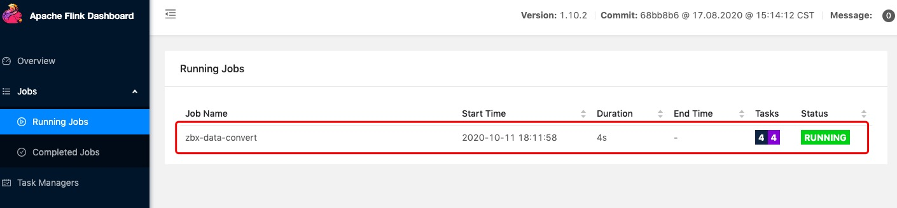

## 背景
zabbix监控的指标太多，但是真正需要统计的监控项就屈指可数了，那么我们可以先过滤掉不需要的数据；
与此同时，我们还可以将一些字段的类型进行转换，方便后面使用.

## 需求说明
需要预处理的数据结构如下:
```json
{
    "host": "my-zbx-host", 
    "groups": [
        "mygroup"
    ], 
    "applications": [
        "CPU", 
        "Performance"
    ], 
    "itemid": 80290, 
    "name": "CPU Used", 
    "clock": 1602407710, 
    "ns": 484334232, 
    "value": 0.292276
}
```
这里我们对kafka里的数据做如下处理后再写入另一个Kafka topic里已用于统计分析
- 我们需要的字段: host, name, clock, value, 分别是zabbix主机名, 监控项名称, 监控取数时间戳, 监控取值
- 只取name为'CPU Used'的记录
- 将clock转换为json的date-time格式

## 代码实现

### 数据转换UDF实现
```python
import logging
import time
from datetime import datetime

from pyflink.table import DataTypes
from pyflink.table.udf import udf

@udf(input_types=[DataTypes.DECIMAL(11, 2)], result_type=DataTypes.STRING())
def ts2str(data):
    try:
        data = int(data)
        return datetime.fromtimestamp(data).strftime("%Y-%m-%dT%H:%M:%SZ")
    except Exception as e:
        logging.error('parse err:', str(e))
        return datetime.now().strftime("%Y-%m-%dT%H:%M:%SZ")
```
### 数据读取定义
这里需要定义Source connector来读取Kafka数据和Sink connector来将处理过后的数据写入Kafka
完整的作业代码见zbx_data_conversion.py

## 安装PyFlink

### 安装
Python版本3.5+, 这里推荐推荐用anaconda进行python多版本管理, 本示例用的3.7.9版本
```sh
$ python --version
Python 3.7.9
```

pip install安装PyFlink, 本示例用的PyFlink版本为1.10.2, 安装的时候请务必带上版本号
```sh
$ pip install apache-flink==1.10.2
```

安装完成后检查是否成功安装了PyFlink和依赖的Beam, 正确显示如下:
```sh
$ python -m pip list |grep apache
apache-beam       2.15.0
apache-flink      1.10.2
```

配置flink环境变量
```
export PATH=$PATH:/Users/me/anaconda3/envs/py37/lib/python3.7/site-packages/pyflink/bin
```

### Copy使用的Connector的JAR包
Flink默认是没有打包connector的，所以我们需要下载各个connector所需的jar包并放入PyFlink的lib目录。首先拿到PyFlink的lib目录的路径：
```sh
$ PYFLINK_LIB=`python -c "import pyflink;import os;print(os.path.dirname(os.path.abspath(pyflink.__file__))+'/lib')"`
$ echo $PYFLINK_LIB
/Users/me/anaconda3/envs/py37/lib/python3.7/site-packages/pyflink/lib
```

然后想需要的jar包下载到lib目录中去：
```sh
$ cd $PYFLINK_LIB
$ curl -O https://repo1.maven.org/maven2/org/apache/flink/flink-sql-connector-kafka_2.11/1.10.2/flink-sql-connector-kafka_2.11-1.10.2.jar
$ curl -O https://repo1.maven.org/maven2/org/apache/flink/flink-jdbc_2.11/1.10.2/flink-jdbc_2.11-1.10.2.jar
$ curl -O https://repo1.maven.org/maven2/org/apache/flink/flink-csv/1.10.2/flink-csv-1.10.2-sql-jar.jar
$ curl -O https://repo1.maven.org/maven2/mysql/mysql-connector-java/8.0.19/mysql-connector-java-8.0.19.jar
$ curl -O https://repo1.maven.org/maven2/org/apache/flink/flink-json/1.10.2/flink-json-1.10.2-sql-jar.jar

```

最终lib的JARs如下:
```
-rw-r--r--  1 changsq  staff      54969  9 28 15:58 flink-connector-kafka-0.11_2.11-1.10.2.jar
-rw-r--r--  1 changsq  staff      36698  9 28 18:04 flink-csv-1.10.2-sql-jar.jar
-rw-r--r--  1 changsq  staff  111503363  9 28 11:53 flink-dist_2.11-1.10.2.jar
-rw-r--r--  1 changsq  staff      89879  9 28 11:53 flink-jdbc_2.11-1.10.2.jar
-rw-r--r--  1 changsq  staff      42404  9 29 10:58 flink-json-1.10.2-sql-jar.jar
-rw-r--r--  1 changsq  staff    2885591  9 28 11:54 flink-sql-connector-kafka_2.11-1.10.2.jar
-rw-r--r--  1 changsq  staff   22542384  9 28 11:53 flink-table-blink_2.11-1.10.2.jar
-rw-r--r--  1 changsq  staff   19315975  9 28 11:53 flink-table_2.11-1.10.2.jar
-rw-r--r--  1 changsq  staff     489884  9 28 11:53 log4j-1.2.17.jar
-rw-r--r--  1 changsq  staff    2356711  9 28 11:54 mysql-connector-java-8.0.19.jar
-rw-r--r--  1 changsq  staff       9931  9 28 11:53 slf4j-log4j12-1.7.15.jar
```
至此环境就准备好了。


## 运行作业

### 启动本地集群
```sh
$PYFLINK_LIB/../bin/start-cluster.sh local
```
启动后打开http://localhost:8081/


### 提交作业,后台启动可以添加参数 -d
```sh
$ flink run -m localhost:8081 -py zbx_data_conversion.py 
Job has been submitted with JobID cb765f5b6d02b00c3e3c94bc2ed30835
```
作业成功提交后如下:

