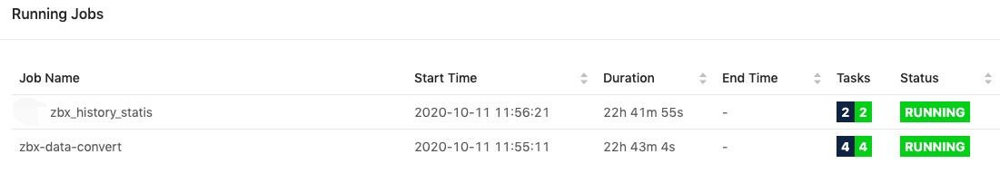
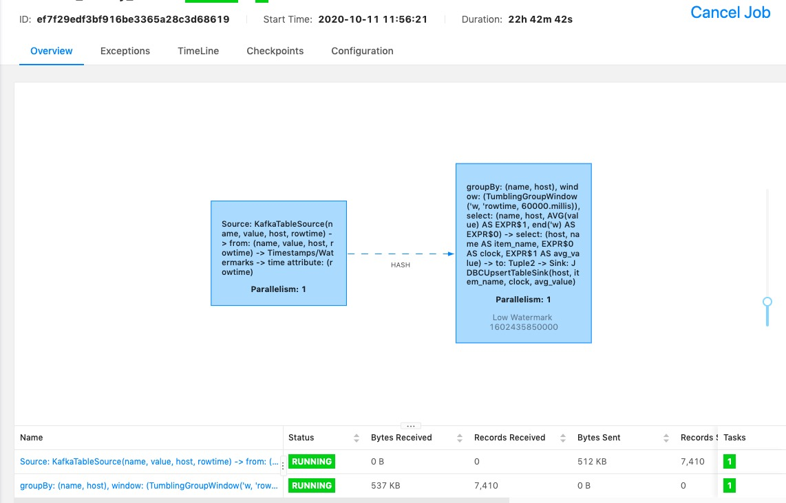
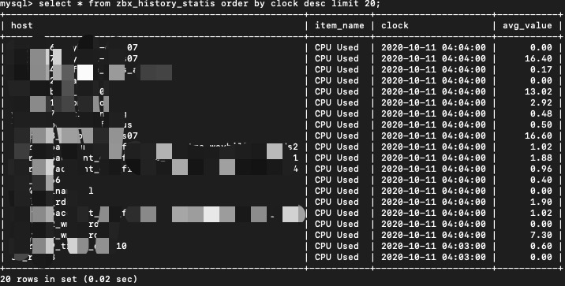

## 需求说明
本示例为了方便介绍, 我们将实际的统计需求进行简化, 从处理过后的kafka队列读取数据, 统计指标:
- 平均值

## 数据读取和结果写入定义
定义Source connector来读取Kafka数据，定义Sink connector来将计算结果存储到MySQL。最后是编写统计逻辑。在这特别说明一下，在PyFlink中也支持SQL DDL的编写，我们用一个简单的DDL描述，就可以实现Connector的开发。SinkConnector的connector.type填写jdbc。
为了丰富示例内容, Source Connector这里没有用DDL, 直接通过代码完成.

### Kafka数据源读取定义
- 连接Kafka: 需要提供kafka服务地址、zk地址、kafka版本、topic、消费组名称(非必须)
- 定义数据源数据格式, json schema, [想了解更多jsonschema](https://json-schema.org/understanding-json-schema/index.html)
```json
{
    "type": "object",
    "properties": {
      "name": {
        "type": "string"
      },
      "value": {
        "type": "number"
      },
      "host": {
        "type": "string"
      },
      "clock": {
        "type": "string",
        "format": "date-time"
      }
    }
}
```
- Schema, 定义我们统计需要的字段: name、value、host、rowtime; 延伸阅读 rowtime, poctime [docs](https://ci.apache.org/projects/flink/flink-docs-release-1.11/api/python/pyflink.table.html)
- 创建数据源

### MySql数据写入DDL定义
```sql
mysql_zbx_history_ddl = """
CREATE TABLE zbx_history_statis (
 host VARCHAR,
 item_name VARCHAR,
 clock TIMESTAMP(3),
 avg_value DECIMAL(38, 18)
) WITH (
 'connector.type' = 'jdbc',
 'connector.url' = 'jdbc:mysql://10.200.113.19:3306/libra_report',
 'connector.table' = 'zbx_history_statis',
 'connector.username' = 'libra_report',
 'connector.password' = 'fjfReport666_',
 'connector.write.flush.interval' = '1s'
)
"""
```

## 核心统计逻辑
- 统计时间窗口(周期) 5分钟
- 案监控项名称、时间周期、主机进行分组统计平均值, [了解更多官方内置函数](https://ci.apache.org/projects/flink/flink-docs-master/zh/dev/table/functions/systemFunctions.html)
- 统计结果写入mysql

```python
t_env.scan("zbx_history_data").window(Tumble.over("5.minutes").on("rowtime").alias("w"))\
   .group_by("w, "
             "host, "
             "name")\
   .select(
           "host, "
           "name as item_name, "
           "w.end as clock, "
           "avg(value) as avg_value") \
   .insert_into("zbx_history_statis")
```

## 完整作业代码
完整代码见src/zbx_history_static.py. 我们整体看一遍完整代码结构，首先是核心依赖的导入; 然后是我们需要创建一个Execution ENV,设置job并行数; 然后再创建Table env, 这里可以通过配置设置planner（目前Flink支持Flink和blink两套planner）建议大家采用 blink planner，本示例没采用; 接下来将我们刚才描述的kafka和mysql的ddl进行表的注册; 再将Python UDF进行注册。UDF所依赖的其他文件也可以在API里面进行制定，这样在job提交时候会一起提交到集群。然后是核心的统计逻辑，最后调用executre提交作业。

## 作业运行情况
至此我们就用两个运行的job了


统计的job详情如下:


MySQL里面存储的统计结果:

